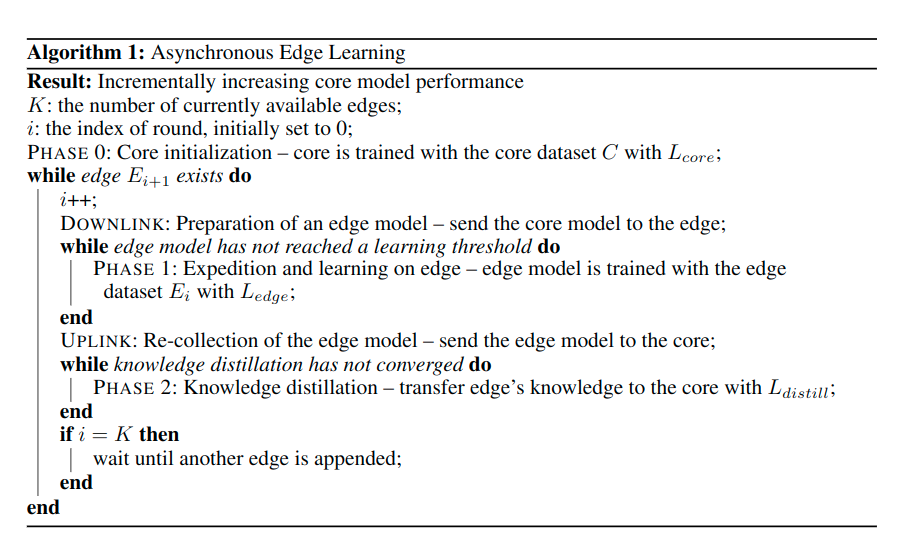

# ASYNCHRONOUS EDGE LEARNING USING CLONED KNOWLEDGE DISTILLATION 

## 背景

现有的联邦学习算法有着以下几个缺点：
* 当用户池（参与联邦学习的设备组成的集合）发生变化的时候，没办法迅速、有效率地处理这些变化
* 需要很大的传输带宽，并且当参与设备的数量增大的时候，需要的传输带宽也会线性地增大
* 需要所有参与某次联邦训练的设备将本地参数上传给中央服务器，这会产生网络延迟

## 论文贡献

这篇文章的主要贡献有以下三点：
* 将联邦学习问题重新表述为用户池动态变化的现实问题，称之为异步边缘学习(asynchronous edge learning)
* 提出了一种知识蒸馏(knowledge distillation, KD)的变种-克隆蒸馏(cloned distillation)，并解释什么时候、和为什么有效，也便是用这种方式代替了梯度上传
* 在利用克隆的知识蒸馏进行异步边缘学习的时候，提出一个可以有效地从分散的边缘数据集中学习并缓解核心模型（中央服务器上的模型）的灾难性遗忘问题的方法

## 异步边缘学习模型

在这里将用户设备称作`edge`，将中央服务器称做`core`，该模型与传统的联邦学习模型的几个区别是：
* 上传的并不是参数，而是经过知识蒸馏之后的一个参数，称作`Knowledge`
* 每个用户上的设备都是异步进行的

整体的模型结构如图所示：

## 算法及训练流程

中央服务器会有一个预先准备好的、小型的数据集（相对于联邦网络来说），在联邦学习开始的时候中央服务器会先在这个数据集上根据损失函数$L_{core}$预先训练出一个模型，然后在联邦学习开始之后并行地将这个模型发送给设备。然后这个模型会根据损失函数$L_{edge}$在本地数据集上进行训练，训练完之后将模型上传给中央服务器，然后中央服务器将会根据损失函数$L_{distill}$来训练全局模型，将edge model上的知识迁移到core model中

这里的$L_{core}$代表的是中央服务器上的数据集所对应的一个Loss值，$L_{edge}$代表的是设备上本地数据集上的一个Loss值，$L_{distill}$代表的是全局的一个Loss值，我们都可以将这些看作是训练模型时的损失函数。其中从`L_{distill}`的表达式中可以看出，中央服务器的训练除了会使用它本地数据集的信息之外，还会使用到局部设备上的数据集的信息

整个训练过程的流程如下图所示：

## 总结-该训练框架的优缺点/启发

### 优点

* 这个异步训练的方法的确让人眼前一亮。该算法只是并行地将中央服务器中预训练好的模型发送给各个设备，而且并不关心该设备是否同意参与/能够参与，然后如果有设备训练好之后将训练好的模型上传给服务器，那么中央服务器便会根据这个上传的模型进行训练，不需要对多个设备的模型进行聚合，也就不存在等待最慢的设备上传模型所造成的延迟
* 在中央服务器上简单地对多个设备的梯度更新进行平均聚合总是让我觉得难以接受，因为这不可避免地会损失一些信息。而这个框架只是将联邦网络作为一个“教师网络”，而中央服务器上的模型是一个“学生模型”，目的是用教师网络的知识去引导学生模型的训练，这种方法更能让我接受

### 缺点

* 不可质疑的是，这种训练方法虽然不需要更大的通信开销，但是需要更大的训练开销。因为相对于传统的联邦学习不需要在中央服务器上进行训练，这篇文章提出的训练方法则需要中央服务器进行K(参与联邦学习的设备的数目)次训练
* 需要很大的缓冲区，因为如果多个设备同时上传训练好的模型，而一个时间点只能有一个模型被中央服务器进行知识迁移，其他模型必须进行等待。在这种过程中可能会有新的节点进来，上传模型给服务器，可能会造成缓冲区溢出

### 启发

* 感觉联邦学习跟迁移学习有着不低的相关度，接下来除了收敛性证明相关，打算看下一些迁移学习的论文，感觉能够得到启发

