# Adaptive Federated Learning in Resource Constrained Edge Computing Systems

主要分享一下我对文章相关数学证明的想法

## 辅助函数

用$[k]$代表一个训练区间$[(k-1)\tau, k\tau]$，表示第$k-1$次全局更新和第$k$次全局更新之间的训练区间，在这个开区间之中只有局部模型的更新

一个辅助函数如下：

$v_{[k]}(t) = v_{[k]}(t-1) - \eta \nabla F(v_{[k]}(t-1))$

这个辅助函数的参数更新代表着与局部模型的更新无关，训练的方法是将所有数据集中在同一个设备上进行梯度的更新（也就是不经过联邦学习的框架直接训练，只是一种理想的状况），由于这样子没有进行联合平均的信息损失，因此往往在一个训练周期内会有更好的训练效果（损失函数的值更小），并且这个辅助函数的值会定期更新，也就是每经过一次全局更新时会被重新设置为全局模型的参数值，如下图所示：

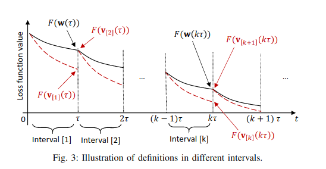

## 假设1

* $F_i(w)$ is convex
* $F_i(w)$ is $\rho-Lipshitz$
* $F_i(w)$ is $\beta-smooth$

这里可以轻易得出$F(w)$也是符合上面三个条件的

## 定理1

证明过程：
* 对于每一个设备i：
  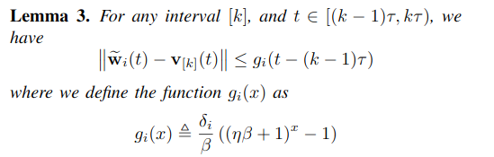
* 再利用联合平均的等式将每个$g_i(x)$关联起来，证明
  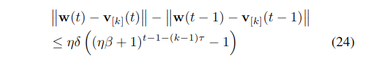
* 最后利用加和消项计算出$||w(t) - v_{[k]}(t)||$ = 
  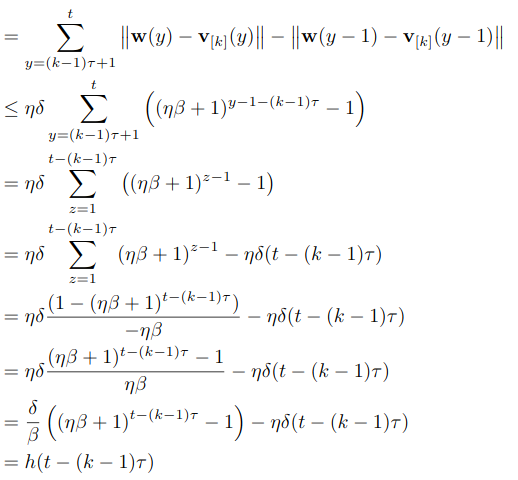

## 引理2

  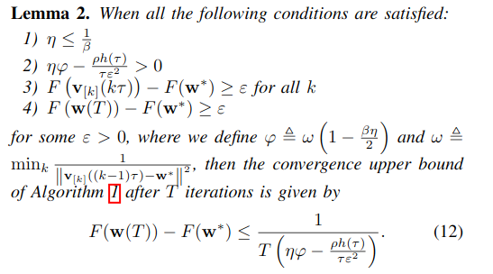

为了证明这个引理，提出了引理4-6来辅助证明

### 引理4

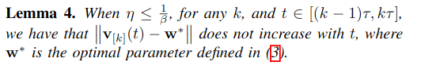

### 引理5

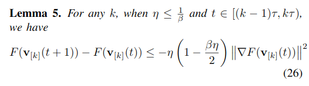

### 引理6

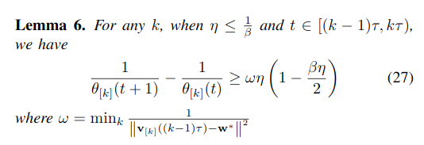

然后开始证明引理2：

同样，先用加和消项：

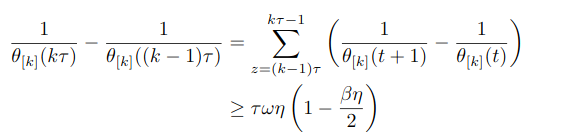

进一步：

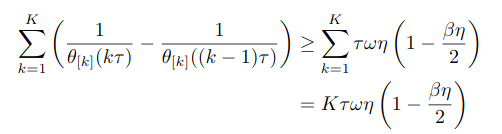

将等式的加和式左边重写，用$T$替换$k\tau$：

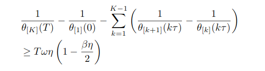

移项：

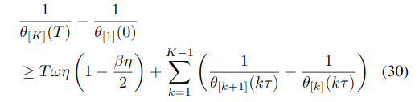

将右边的项化简：

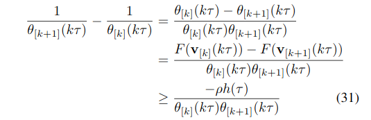

根据引理5,有

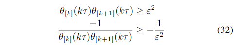

然后就可以缩放了：

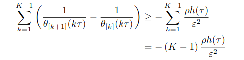

根据假设$F(W(T)) - F(w^*) >= \epsilon$，有：

则：

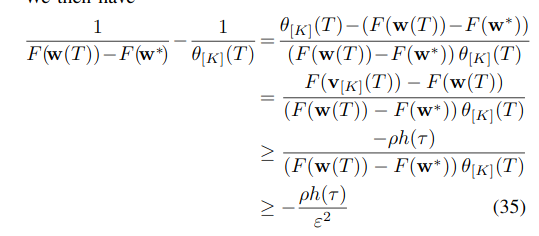

然后综合上式：

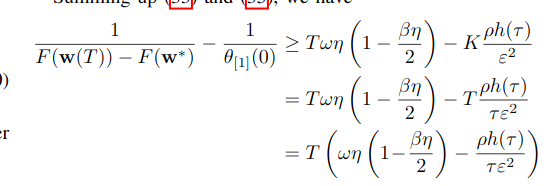

显然：

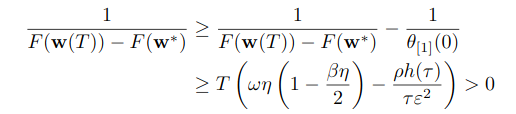

倒一下项：

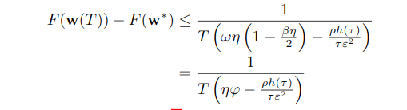

得证