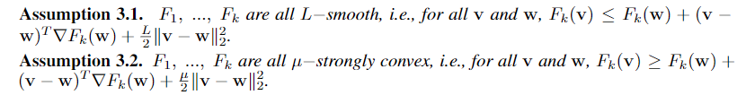
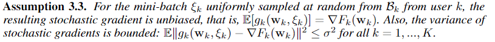
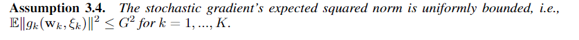
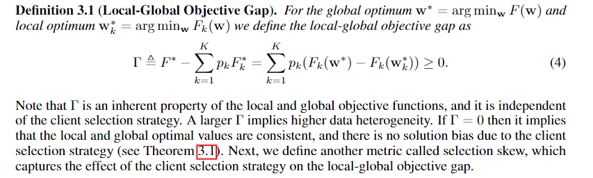
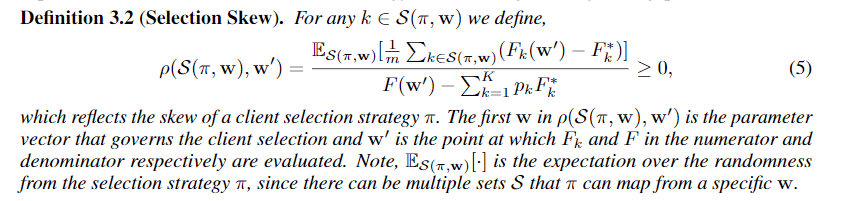
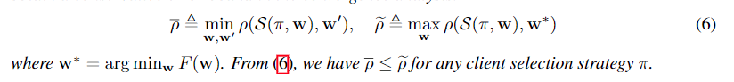
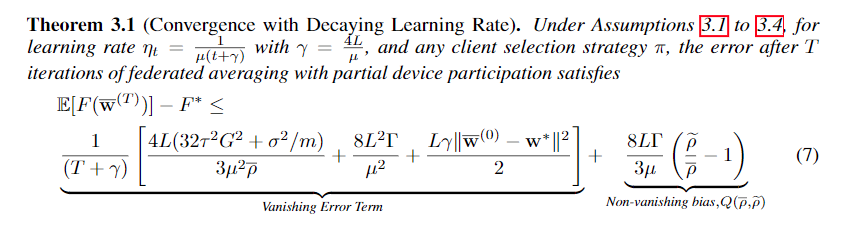
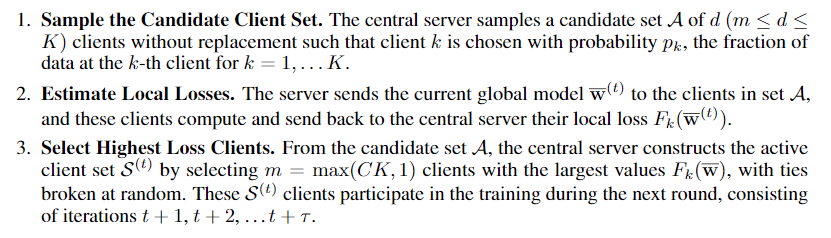
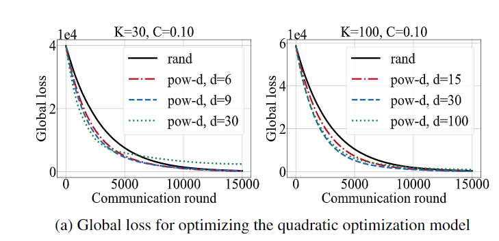

# Client Selection in Federated Learning: Convergence Analysis and Power-of-Choice Selection Strategies

## 背景

现有的关于联邦学习的收敛性证明已经囊括了Full Participation和Partical Participation的收敛性证明，但是这些工作都是默认选择到的设备都是无偏差的情况(unbiased)，这里的偏差指的是相同的全局模型在不同的设备上的不同表现。现有的联邦学习收敛性证明工作都是用一个差值上界来统一这些差异。这篇文章指出，如果在每一轮选择训练的设备的时候偏向于选择具有较高损失的设备，可以得到更快的收敛速度

## 论文贡献

* 提出了考虑到设备偏差的第一个收敛性证明
* 提出POWER-OF-CHOICE设备选择机制

## 收敛性分析

### 假设

完成这篇文章的收敛性分析需要四个假设：

前两个条件是$L-smooth条件$和$\mu-strong convex$条件：

第三个假设的意思是，虽然每次选择到的设备有偏差，但是在设备本地训练的时候进行mini-batch默认是没有偏差的：

第四个假设的意思是，随机梯度的期望平方范数是一致有界的：

### 相关定义

这片论文的核心在于如何定义设备选择的偏差，文章给出了两个定义：

第一个是局部-全局偏差，是系统误差：

第二个是选择偏差，是选择设备策略导致的偏差与局部-全局偏差之比的相对误差

其中这里$\pi$代表的是选择训练设备的策略，第一个$w$代表的是决定选择策略的模型参数，它可以是当前的全局模型的参数。第二个$w'$可以理解为是在选择策略$\pi$下它与选择到的设备模型之间的偏差与它与全局模型之间的偏差的一个比值

然后将选择机制$\pi$下的选择偏差最小值定义为$\overline{\rho}$，将选择机制$\pi$下与全局最优模型的偏差最大值定义为$\widetilde{\rho}$

### 收敛性结果

从上述结果中我们可以看出：

* Large $\overline{\rho}$ and Fast Convergence：如果选择策略偏向于选择那些偏差大的设备，那么系统会更快达到收敛
* Non-vanishing Bias Term：式子中的第二项由选择策略决定，如果$\overline{\rho}$比较大的话，那么收敛边界会更加接近最优值

## 选择策略：POWER-OF-CHOICE

核心步骤就是选择训练设备的时候倾向于选择那些局部损失高的

与我们熟悉的联邦学习过程的唯一不同便是，中央服务器从参与的设备中随机抽样出一部分候选设备之后，还要根据它们的局部损失来进行选拔，最后选择局部损失最大的几个设备来进行训练

## 实验

他们通过实验证明了确实这种选择机制可以加快系统的收敛速度

## 结论

这篇论文提出的POWER-OF-CHOICE机制算是比较自然的想法，但是这篇论文给出了不同的选择机制下的收敛性分析方法，我觉得是一个很不错的亮点，另外就是委员会机制下的选择策略跟这篇文章的选择策略有着异曲同工之妙，委员会是倾向于选择那些损失函数比较低的，而POWER-OF-CHOICE选择的是损失函数比较高的，虽然两者的训练目的不同，但是我觉得这篇文章的收敛性分析方法用到委员会机制下，也是完全可以的