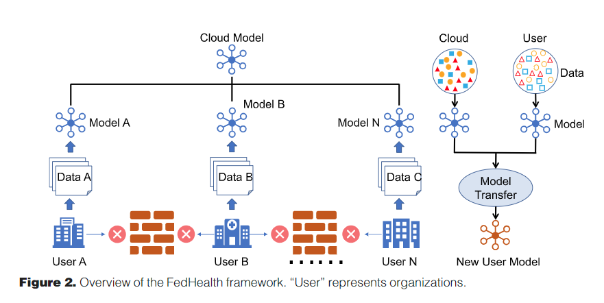
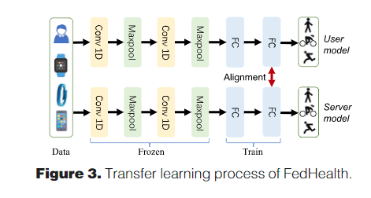
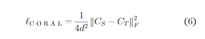
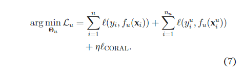
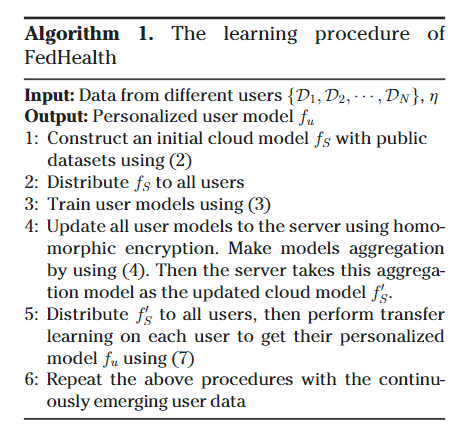
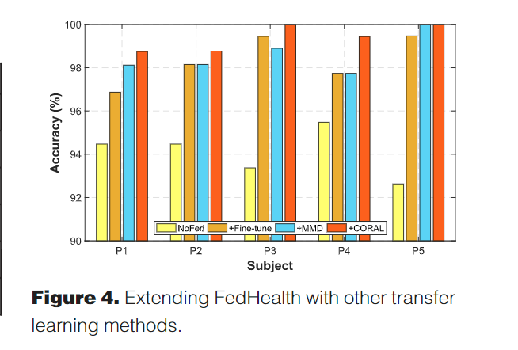
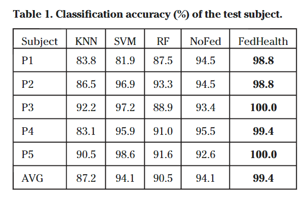

# FedHealth:AFederated TransferLearning Frameworkfor WearableHealthcare 

## 背景

这篇论文的动机是想用联邦学习来训练一个能预测人们疾病风险的模型，方法是从人们身上的可佩戴设备中获取传感器数据并应用联邦学习框架来进行训练，但是由于对于疾病的预测需要保证模型具有较高的“个性化”，也就是所谓的“因人而异”，而现有的联邦学习框架并不能保证这一点，因为服务器在对上传的模型进行联合平均的时候会损失这种“个性化”的程度。这篇论文的处理方法是用迁移学习来保证这种“个性化”

## 框架

整个框架跟传统的联邦学习差别不大，唯一的区别就是，设备在进行第i次(i>1)训练的时候，使用的是迁移学习的训练方法，训练时用到的参数包括上一次训练得到的本地模型和这一次训练从服务器上下载得到的全局模型（传统联邦学习就只用到下载得到的全局模型）

## 迁移学习的训练

迁移学习发生在上图右边的部分中，一个新的模型(New User Model)会从两个模型(Cloud Model和User Model)训练得到，训练的方式将以一个CNN网络训练的方式来说明：

我们假设这个CNN网络有2个卷积层，有2个池化层，2个全连接层，还有一个softmax层（在图中没有画出来），因为卷积层和池化层是为了提取特征，因此在训练的时候并不会改变这些层的参数。为了实现全局模型和设备模型的“域适应”，将第二个全连接层替换为“对准层”(alignment layer)，在这层上的损失函数是：

这里面$C_S$是源模型(Source Model，在本文的背景下一般是全局模型)特征的协方差矩阵，$C_T$是目标模型(Target Model，在本文的背景下一般是设备模型)特征的协方差矩阵

因此，新设备模型(New User Model)的损失函数可以写成：

## 训练的算法

* 服务器在自身的数据集上进行训练出一个Cloud模型$f_s$
* 将该模型$f_s$发送给所有设备
* 设备在本地的数据集上进行训练更新$f_s$的参数
* 设备将更新后的模型发送给服务器，服务器对接收到的模型进行联合平均得到全局模型$f_s^{'}$
* 服务器将$f_s^{'}$发送给设备，然后设备根据上一次训练得到的模型和$f_s^{'}$进行迁移学习训练，得到个性化的模型$f_u$
* 当有新的用户数据到来的时候，重复上诉步骤

## 实验

可以看到本文提出的FedHealth与其他迁移学习方法相比要具有更高的准确率，但是这面没有FedHealth与普通的FedAvg方法的比较，我觉得是这篇论文在设置实验上的一个缺点

FedHealth方法在相比于传统的机器学习方法，也具有更高的准确率，但是这个好像没啥太大的意义

## 总结

本来是想看一下迁移学习，看看能不能找到一种能代替目前的联合平均的更好的聚合不同模型的方法，但是这篇论文的重点并不在于此，而提到的保证模型“个性化”的方法，我觉得也是一个不错的、比较通用的提高模型在不同设备上的准确率的方法