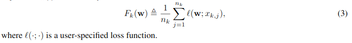
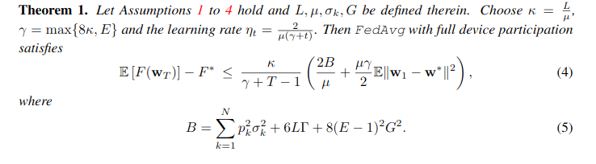
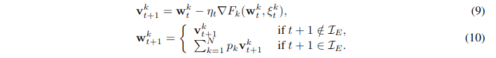
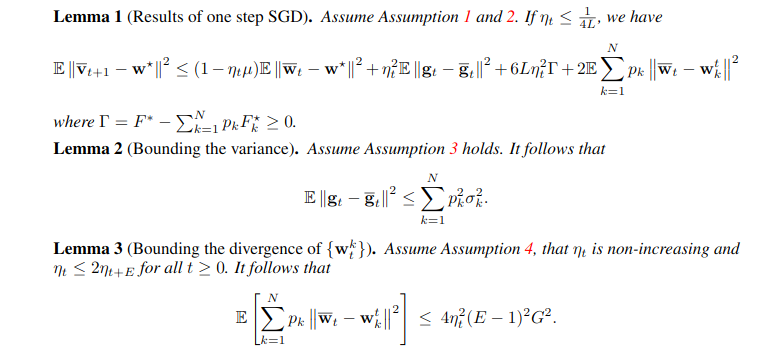
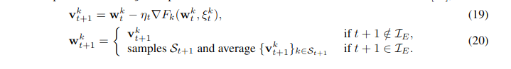
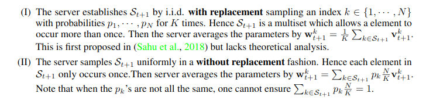
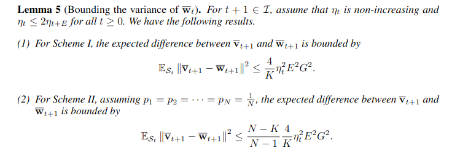
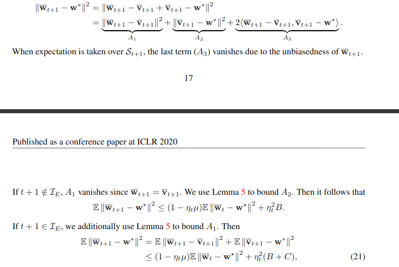
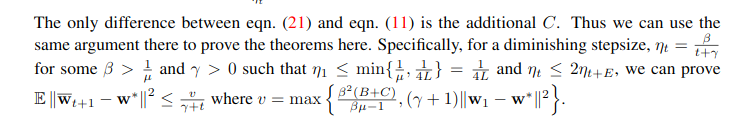
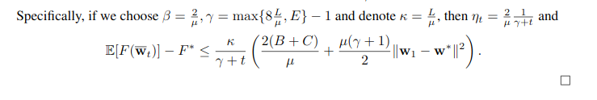

# ON THE CONVERGENCE OF FEDAVG ON NON-IID DATA

这篇论文给出了不需要分布数据集是IID的假设的一个收敛上界

## 背景

现有的联邦学习关于收敛性证明的工作需要有以下两个假设：

* 分布在不同的设备上的数据集是IID的
* 参与联邦学习的每一个设备都能与服务器保持稳定的连接

事实上这两个假设在现实部署的过程中是难以实现的，首先，保证不同设备上的数据集都是IID的显然是难以保证的，其次，我们也无法保证参与联邦学习的每一个设备都时刻保持有效的连接，当某一台设备关闭电源或者断开连接的是否，那么服务器和其他设备都需要等待这一台的重启或重新连接，这明显会造成很大的耗费

对于第二个问题的解决办法是每次服务器向设备广播数据集的时候都会选择其中保持连接的一部分设备进行广播然后进行训练，而不是向所有的设备进行广播

## 贡献

该论文主要有以下两个贡献：

* 给出了不需要以上两个假设的两个收敛上界，分别包括Full Device Participation(每次都选择所有的设备来训练)和Partial Device Participation(每次只选择一部分的设备进行训练)
* 提出全局模型更新的步长需要衰减，并给出解释

## 定义

损失函数：

在某个设备上的损失函数：

在某个设备上的local update:

Full Device Participation下全局模型的更新：

Partical Device Participation下全局模型的更新：

## 收敛上界

这篇论文给出的收敛上界需要满足以下4个假设：

然后它给出的Full Device Participation收敛上界是：

给出的Partial Device Participation收敛上界是：

## 证明

### 定理1

证明：

定义一个辅助变量$v_{t+1}^{k}$:

这个辅助变量的作用可简单看作一个中间变量，（10）的第一个条件的意思是$t+1$次迭代训练不需要进行联邦平均，第二个条件的意思是$t+1$次迭代训练需要进行联邦平均

提出三个引理来辅助证明（这三个引理怎么得到的后面讨论）：

证明过程及思路如下：

### 定理2

更新方式：

两种更新方式：

主要区别：
* 第一种方法是重复$K$次，每次选择一个设备，最终能选择出$K$个设备，并且一个设备可以被选择多次
* 第二种方法是直接从$N$个设备中选出$K$个设备，每个设备在本次训练中最多能选择一次

然后给出了这两种选择方法的$\overline{v}_{t-1}$和$\overline{w}_{t-1}$的差值上界：

证明过程大致与证明定理1的一样，区别在于定理1不适用了：

后面就是直接改变一些值便能得到结果：

还是证明定理1时的公式：

然后直接代入：

## 结论

这篇论文给出了不需要数据集为IID的假设的收敛上界，并且关于步长对于收敛性的影响进行了讨论，我觉得是一篇比较有开创性的文章。相关的数学证明我还会继续去研究一下

