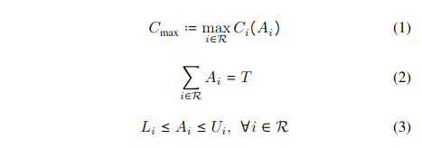
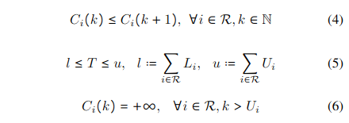
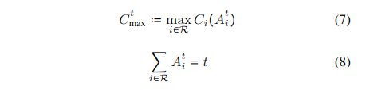
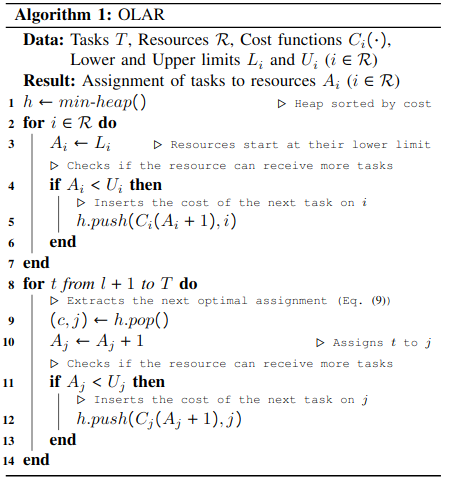
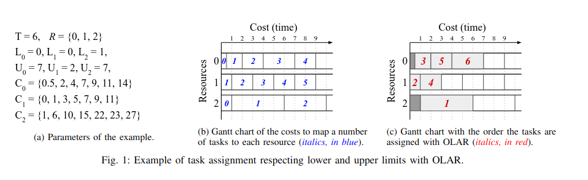

# Optimal Task Assignment to Heterogeneous Federated Learning Devices 

## 背景

一个联邦学习系统的性能一般受以下两个因素影响：
* 每一个训练周期的时间
* 训练周期的数量

第二个因素主要受到数据集的大小和数量的影响，因此该论文主要关注于第一个因素

在联邦学习的一个训练周期中，一个设备需要花费的时间长短取决于它自身的计算能力和通信的效率。由于参与联邦学习的设备是异构的并且需要将数据同步到中央服务器中，一个训练周期的时间长短便取决于参与联邦学习中需要花费时间最长的设备，这会造成瓶颈，其他设备必须等待这一个最慢的设备才能进行下一轮训练

## 定义

首先介绍一些定义：
* `T\in N`:相同的、独立的、原子的训练任务，在这里我们可以简单地将其认做所有设备训练次数的总和
* `R`:资源的集合，在这里我们可以将其认做为参与到联邦学习中的设备,`i\in R`，其中一个`i`代表一个设备
* `A_i`：分配给设备`i`的训练任务的集合。在传统的联邦学习中我们每个训练轮次都会选择`R`中的一部分设备来进行训练，那么设备$i$如果选到进行训练的次数为$t$，则$A_i \triangleq t$
* $C_i(A_i)$：设备$i$完成分配给它的训练任务所需要的花销（可以理解为训练时间）
* $C_{max}$：完成该次联邦学习任务所需要的时间

根据以上定义，我们可以得到以下等式：

* 等式1：完成一次联邦学习任务所需要的时间等于所有设备中花费最多的时间
* 等式2：根据$A_i$和$T$的定义可得
* 等式3：分配给一个设备的训练任务有上界和下界
* 等式4：$C_i$是非递减函数
* 等式5：一个简单的加和
* 等式6：如果分配给一个设备的训练任务超过了它的上界，那它的花销时间为无穷大
* 等式7，8：$t \leq T$，$C_{max}^T = C_{max}$

## 算法

该算法会维护一个最小堆，存放的数据结构是$(C_i(A), i)$，也就是设备$i$以及分配给设备$i$的训练任务的一个二元组，整个算法大概是以下步骤：
* 首先分配给每个设备$i$它的训练任务的下界：$A_i \leftarrow L_i$
* 之后从$l+1$开始，每次从堆中取出一个二元组$(c, j)$，更新这个二元组的值，也就是将第$l+1$个训练任务分配给设备$j$：$A_j \leftarrow A_j + 1$，并且如果这个训练任务并没有超过设备$j$可以承受的最大训练任务数，将它压入栈中
* 最后输出训练任务的分配方式$A_i$

## 例子

## 总结

该论文所介绍的算法算是比较容易可以想到的，个人也觉得有一些局限性，例如：
* 我们在使用该算法去分配训练任务的时候，需要提前知道具体某个设备完成某个训练任务的时间
* 即便我们可以通过该设备上数据集或者通信效率去估算这个时间，但也有着以下问题：
  * 如果某一个设备通信效率很好，那么该算法就会反复选择该设备进行训练，同样，那些通信时间长的设备将几乎不怎么参与到训练中，本论文对这个问题的解决办法仅仅是对每一个设备的训练任务数设定了一个上下界
  * 该算法可能会对资源分配的公平性产生影响

总的来说，该算法虽然可以减少一个联邦学习任务所需要的训练时间，但它同时会牺牲一些训练出来的模型的性能

