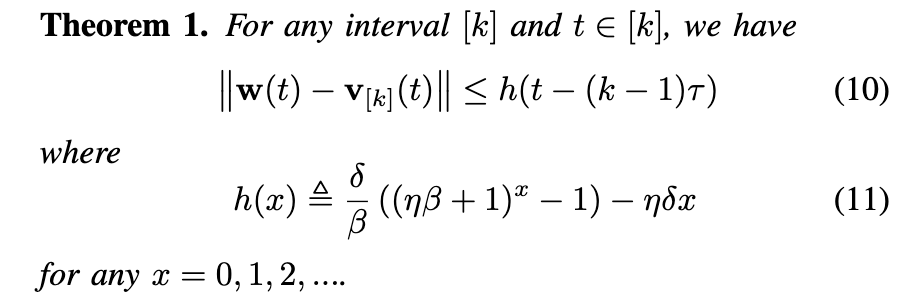
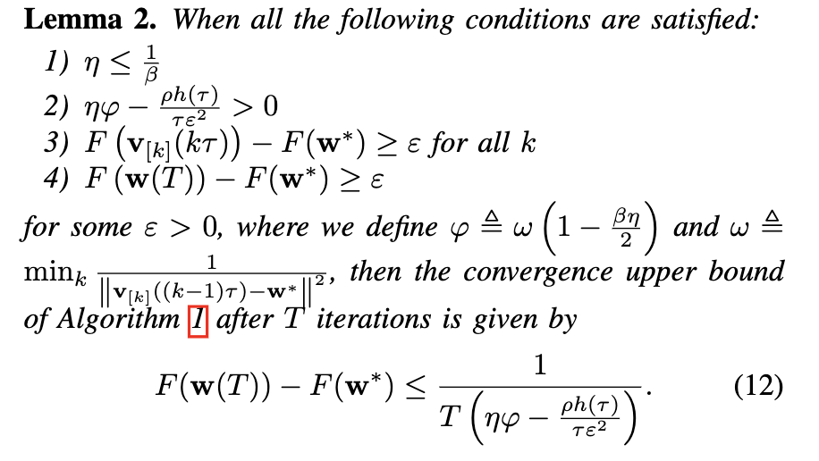
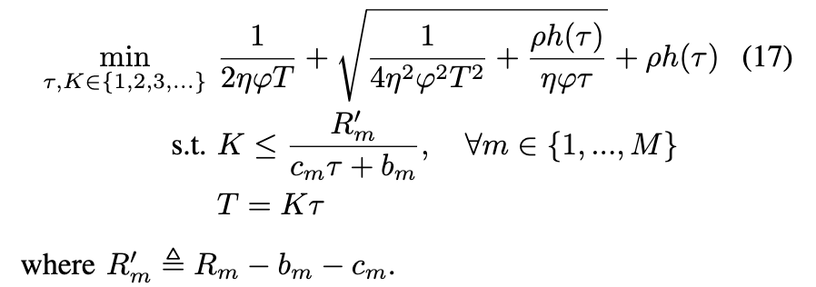
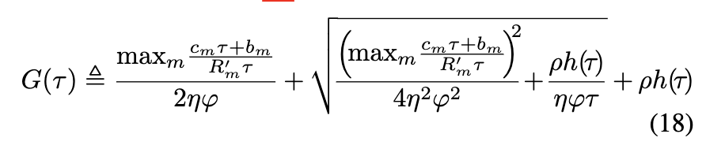
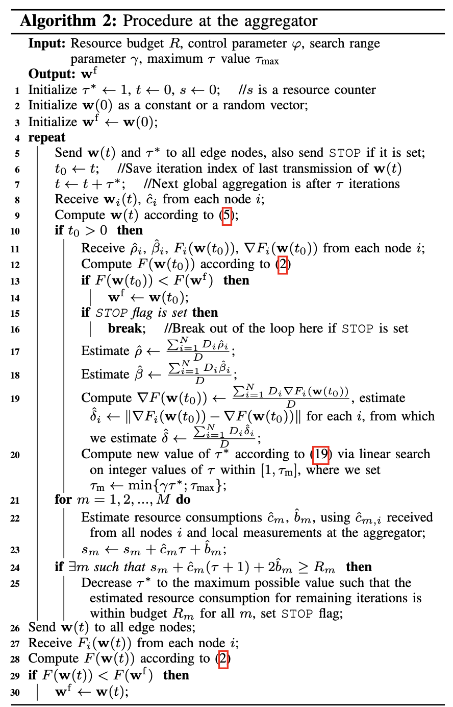
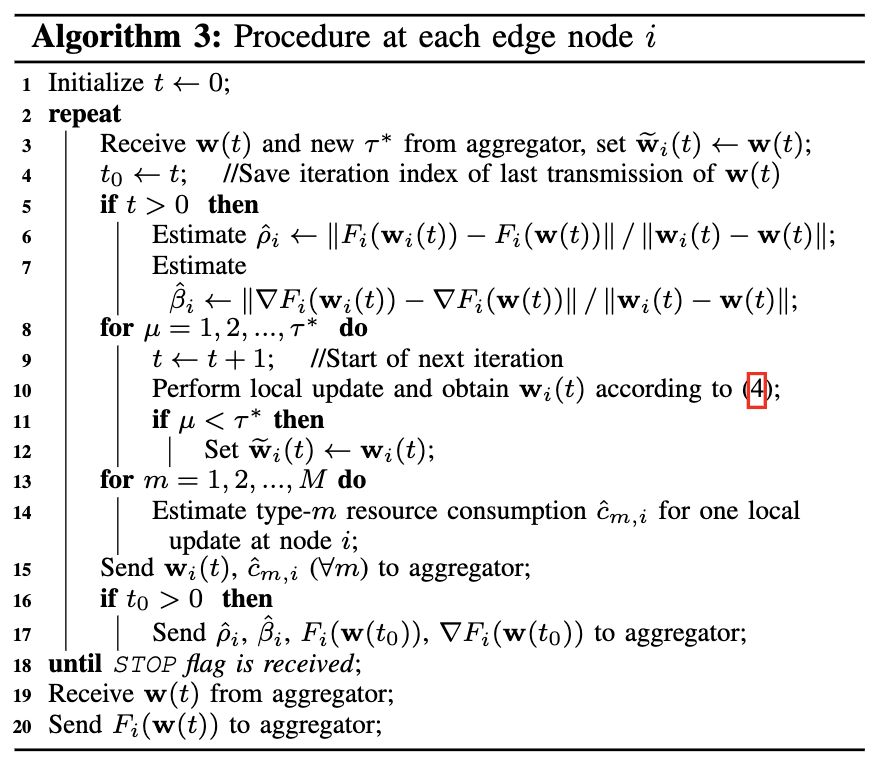

# Week2-Adaptive Federated Learning in Resource Constrained Edge Computing Systems

一篇研究如何在有限的资源条件下进行联邦学习的论文，涉及到比较多的数学知识

## 问题背景

如何有效利用给定数量的资源以最小化模型训练的损失函数。也就是对于传统的联邦学习机制，如何确定总的训练轮次$T$和全局模型的更新周期$\tau$($T = K\tau$，也就是每经过$\tau$轮次进行一次全局模型的更新)的最佳值，从而使得全局损失函数在此学习任务的给定资源约束下最小化，也就是说$T$和$\tau$的值具有一定的次数限制。可以将优化问题定义为：
$$
min_{\tau, K \in {1, 2, 3, ...}}F(w^f), \\
s.t. (T+1)c_m + (k+1)b_m <= R_m, \forall m \in \{1, ..., M\}, T = K\tau
$$

## 核心思想

通过在训练过程中改变$\tau$的值，来动态调整全局模型更新的周期，并控制$T$的值，使得在资源有限的情况下保证训练的轮次尽可能多

假设我们的学习目标：$w^* = argmin_wF(w)$，也就是理论上使得$F(w)$最小的那个值，论文先给出一个$F(w^f) - F(w^*)$的收敛上届，然后进一步提出一个适用于以上问题的优化算法。

## $F(w^f) - F(w^*)$的收敛上界

首先进行一些预定义，将$T$个迭代轮次分为$k$个间隔，以全局模型更新作为划分的点

* 用$[k]$表示间隔$[(k-1)\tau, k\tau]$
* 定义一个辅助参数：$v_{[k]}(t)$，计算方法为$v_{[k]}(t) = v_{[k]}(t - 1) - \eta \nabla F(v_{[k]}(t))$，为后面的证明服务，其中$t \in \{(k-1)\tau, k\tau \}$
* 这个辅助参数会定时更新，即$v_{[k]}((k-1)\tau) = w({k-1}\tau)$

接下来求解$F(w^f) - F(w^*)$的收敛上界，分为两个步骤：

* 计算$w(k\tau)和v_{[k]}(k\tau)$的差
* 根据$w(k\tau)和v_{[k]}(k\tau)$的差和在一个间隔$[k]$内的$v_{[k]}(t)$收敛边界来求解最后结果

这部分的计算比较复杂，在这里只给出结论

$w(k\tau)和v_{[k]}(k\tau)$的差：

在一个间隔$[k]$内的$v_{[k]}(t)$收敛边界:

则$F(w^f) - F(w^*)$的收敛上界为：

## 算法

对于一个确定的损失函数$F$，它的$F(w^*)$是确定的，因此优化$F(w^f)$相当于优化$F(w^f) - F(w^*)$，也便是优化：

该函数随$T$递减，也随$K$递减，则$K$的最优值为：$\lfloor min_m\frac{R^{'}_m}{c_m\tau + b_m}\rfloor$

则$T = K\tau \approx min_m\frac{R^{'}_m}{c_m\tau + b_m} = 1/max_m\frac{c_m\tau + b_m}{R_m^{'}\tau}$  代入（17）式可得：

因此我们可以确定$\tau$的最优值：

在实际的操作过程中，这个最优值可以通过线性搜索的方式来进行

在服务器中的训练过程：

在设备上的训练过程：

简单来说，就是每当设备进行了$\tau$轮次的训练，便会将一些参数上传给服务器（包括$w_i(t), \beta_i$等），然后服务器在对$w(t)$进行联合平均之外，还会根据设备上传的参数计算一个新的$\tau^*$，然后在下一轮次传给设备进行$\tau^*$轮次的训练。同时如果当前剩下的资源不足的时候，服务器会向设备发送一个`STOP`指令以结束训练过程

## 亮点

* 算法中最亮眼的地方在于如何确定$\tau$，使得可以用最少的资源来获得尽可能大的训练效益。这里确定$F(w^f) - F(w^*)$的收敛上界->优化$F(w^f)$->优化$F(w^f) - F(w^*)$的思路确实令人眼前一亮
* 在计算$F(w^f) - F(w^*)$的收敛上界的时候，使用一个辅助参数$v_{[k]}(t)$来方便后续的计算和证明，是一个很难想到的点

## 一些想法

* 这篇论文涉及到的一些方法，也许可以运用到许多地方，特别是上面提到的第一个亮点，是一种很不错的思路
* 这个算法的不足之处是较大增加了通讯的开销。设备在每次上传参数的时候，不仅需要将更新后的$w(k\tau)$上传给服务器，还需要上传$F_i(w(t_0)), \nabla F_i(w(t0))$以及其他参数给服务器，这增大了通讯的开销。这个问题可以通过模型压缩的办法来得到一定的缓解
* 这个算法的另外一个不足之处是服务器在进行联合平均以及选择下一个$\tau^*$的时候也需要花费更多的开销，特别是在现行搜索使得$G(r)$最小的$\tau^*$的时候